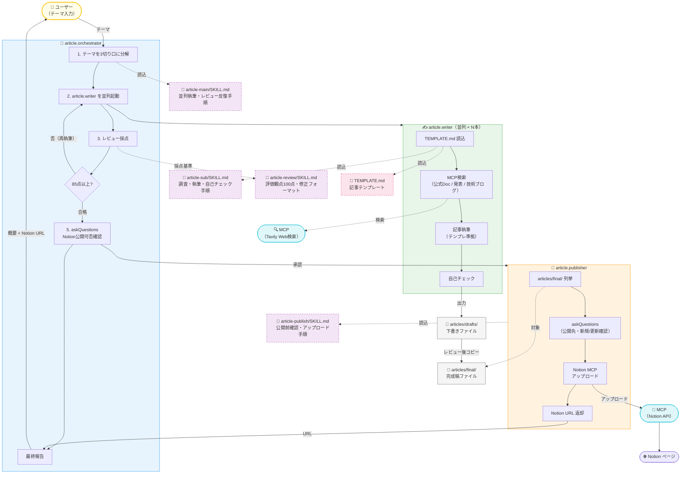

# 記事作成ワークフロー

```mermaid
flowchart TB
    User(["👤 ユーザー\n（テーマ入力）"])

    User -->|"テーマ"| ORC1

    subgraph ORC["🧭 article.orchestrator"]
        direction TB
        ORC1["1. テーマを3切り口に分解"]
        ORC2["2. article.writer を並列起動"]
        ORC3["3. レビュー採点"]
        ORC4{"85点以上?"}
        ORC5["5. askQuestions\nNotion公開可否確認"]
        ORC6["最終報告"]
        ORC1 --> ORC2
        ORC2 --> ORC3
        ORC3 --> ORC4
        ORC4 -- "否（再執筆）" --> ORC2
        ORC4 -- "合格" --> ORC5
        ORC5 --> ORC6
    end

    ORC2 --> WRT

    subgraph WRT["✍️ article.writer（並列 × N本）"]
        direction TB
        W1["TEMPLATE.md 読込"]
        W2["MCP検索\n（公式Doc / 発表 / 技術ブログ）"]
        W3["記事執筆\n（テンプレ準拠）"]
        W4["自己チェック"]
        W1 --> W2
        W2 --> W3
        W3 --> W4
    end

    ORC5 -->|"承認"| PUB

    subgraph PUB["📝 article.publisher"]
        direction TB
        P1["articles/final/ 列挙"]
        P2["askQuestions\n（公開先・新規/更新確認）"]
        P3["Notion MCP\nアップロード"]
        P4["Notion URL 返却"]
        P1 --> P2
        P2 --> P3
        P3 --> P4
    end

    SK_MAIN["📄 article-main/SKILL.md\n並列執筆・レビュー反復手順"]
    SK_SUB["📄 article-sub/SKILL.md\n調査・執筆・自己チェック手順"]
    SK_REV["📄 article-review/SKILL.md\n評価観点100点・修正フォーマット"]
    SK_PUB["📄 article-publish/SKILL.md\n公開前確認・アップロード手順"]
    TMPL["📄 TEMPLATE.md\n記事テンプレート"]

    DRAFTS["📁 articles/drafts/\n下書きファイル"]
    FINAL["📁 articles/final/\n完成稿ファイル"]

    MCP_SEARCH(["🔍 MCP\n（Tavily Web検索）"])
    MCP_NOTION(["📓 MCP\n（Notion API）"])
    NOTION_PAGE(["🌐 Notion ページ"])

    ORC1 -.->|"読込"| SK_MAIN
    ORC3 -.->|"採点基準"| SK_REV
    W1 -.->|"読込"| SK_SUB
    W1 -.->|"読込"| TMPL
    W2 -.->|"検索"| MCP_SEARCH
    W4 -->|"出力"| DRAFTS
    DRAFTS -->|"レビュー後コピー"| FINAL
    PUB -.->|"読込"| SK_PUB
    P1 -.->|"対象"| FINAL
    P3 -->|"アップロード"| MCP_NOTION
    MCP_NOTION --> NOTION_PAGE
    P4 -->|"URL"| ORC6
    ORC6 -->|"概要 + Notion URL"| User

    style User fill:#fffde7,stroke:#FFC107,stroke-width:2px
    style ORC fill:#e8f4fd,stroke:#2196F3
    style WRT fill:#e8f5e9,stroke:#4CAF50
    style PUB fill:#fff3e0,stroke:#FF9800
    style SK_MAIN fill:#f3e5f5,stroke:#9C27B0,stroke-dasharray:4
    style SK_SUB  fill:#f3e5f5,stroke:#9C27B0,stroke-dasharray:4
    style SK_REV  fill:#f3e5f5,stroke:#9C27B0,stroke-dasharray:4
    style SK_PUB  fill:#f3e5f5,stroke:#9C27B0,stroke-dasharray:4
    style TMPL    fill:#fce4ec,stroke:#E91E63,stroke-dasharray:4
    style DRAFTS  fill:#f5f5f5,stroke:#757575
    style FINAL   fill:#f5f5f5,stroke:#757575
    style MCP_SEARCH fill:#e0f7fa,stroke:#00BCD4
    style MCP_NOTION fill:#e0f7fa,stroke:#00BCD4
```
